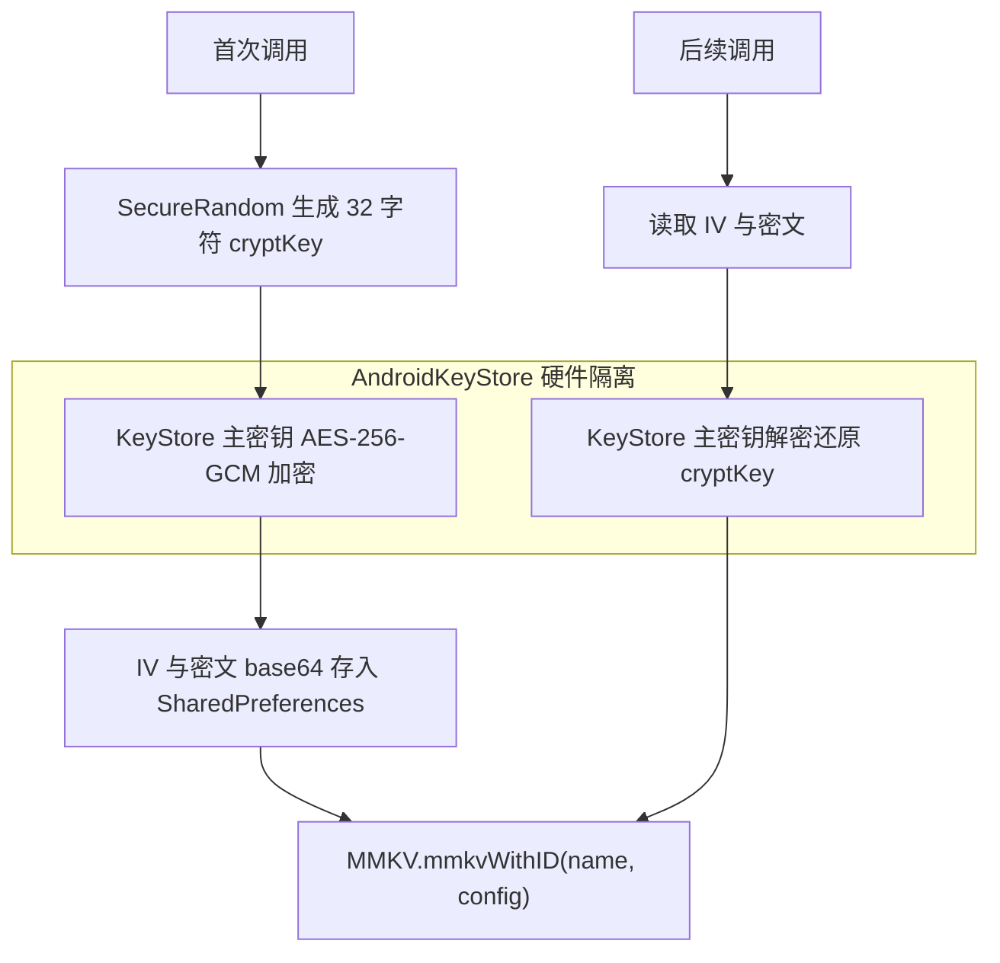

# storage 模块编译恢复与 MMKV 加密修复方案

| 项目 | 内容 |
| --- | --- |
| 制定日期 | 2026-08-11 |
| 状态 | 待实施 |
| 本轮范围 | 恢复 `:app` 编译；把 MMKV 的假加密替换为真实 AES-256-CFB 加密 |
| 明确不含 | 包名重命名、DataStore 委托缺陷、线程切换、序列化层重建、补测试、文档重写 |

## 一、验证结论

以下结论均在本机实测得出，不是静态推断。

| 验证项 | 命令 | 结果 |
| --- | --- | --- |
| 三个 storage 模块 | `./gradlew :storage:assembleDebug :storage-datastore:assembleDebug :storage-mmkv:assembleDebug` | BUILD SUCCESSFUL |
| app 模块 | `./gradlew :app:compileAlphaDebugJavaWithJavac` | BUILD FAILED，7 errors |
| mmkv 2.4.1 API | `javap` 反编译 aar 内 `classes.jar` | 见第三节 B2 |

目录重命名（`ghstorage` 到 `storage` 等）已完成，`settings.gradle` 与 `app/build.gradle` 的模块引用已同步，但 package 与 namespace 仍是 `com.pankoku.ghstorage.*`。

`:app` 的 7 个错误全部源自同一个根因：`app/src/main/kotlin/com/github/app/GHStorage.kt` 是 Kotlin 文件且被两个 Java 文件 import，但 `app` 模块此前没有应用 Kotlin 插件，该文件不参与编译。连锁反应是 `AppModule.java` 与 `AppComponent.java` 找不到符号，Dagger 处理器随之崩溃，`DaggerAppComponent` 未生成，`GitHub.java` 一起报错。

## 二、任务 A：恢复 `:app` 编译

### A1. Kotlin 插件（部分已完成）

`app/build.gradle` 已补上以下两行，无需重复操作：

```groovy
apply plugin: 'kotlin-android'
apply plugin: 'kotlin-kapt'
```

同时 Dagger 与 Glide 的注解处理已从 `annotationProcessor` 切换为 `kapt`。这个选择是正确的：`GHStorage.kt` 带 `@Singleton` 与 `@Inject constructor`，只有 kapt 才能让 Dagger 正确处理 Kotlin 侧注解。

### A2. 补 `kotlinOptions`

仍需在 `android { }` 块内、`compileOptions` 之后加入：

```groovy
kotlinOptions {
    jvmTarget = '17'
}
```

`17` 与现有 `compileOptions` 的 `VERSION_17` 对齐。若缺省，Kotlin 默认 jvmTarget 与 Java 的 17 不一致，会报 "Inconsistent JVM-target compatibility detected"。

### A3. 解除 Kotlin 版本降级（关键）

根 `build.gradle` 使用 `org.jetbrains.kotlin:kotlin-gradle-plugin:2.2.10`，但 `app/build.gradle` 末尾把所有 `org.jetbrains.kotlin` 依赖强制降到 `1.8.10`：

```groovy
configurations.configureEach {
    resolutionStrategy.eachDependency { DependencyResolveDetails details ->
        def requested = details.requested
        if (requested.group == 'org.jetbrains.kotlin') {
            details.useVersion '1.8.10'   // 改为 '2.2.10'
        }
    }
}
```

把 `1.8.10` 改为 `2.2.10`。保留这段配置本身的"统一版本"意图，比整段删除更保守。

改动理由有两层，第二层是引入 kapt 后新增的：

1. 2.2.10 编译器产出的 class 带 Kotlin 2.2 metadata，配 1.8.10 的 stdlib 会报 "compiled with an incompatible version of Kotlin"
2. kapt 自身的构件（`kotlin-annotation-processing-gradle` 等）同属 `org.jetbrains.kotlin` group，被强制降到 1.8.10 会与 2.2.10 的插件不匹配

### A4. 已排除的风险

这三项已核查过，不需要额外改动：

- `dataBinding true` 已启用，但所有 layout 只用 `tools:context` 指向 Java Activity（`LandingActivity`、`LoginActivity`、`MainActivity`、`ProfileView`），没有 `<data>` 绑定 Kotlin 类
- `GHStorage.kt` 只引用 `storage` 模块与 `javax.inject`，不引用 app 内任何 Java 类，无 Kotlin/Java 循环依赖
- `kotlin-android` 插件会自动把 `src/main/kotlin` 注册进 Kotlin sourceSet，`app/build.gradle` 里的 `sourceSets` 块未覆盖 `java.srcDirs`，不冲突

### A5. 验证

```bash
./gradlew :app:compileAlphaDebugJavaWithJavac
```

预期从 7 errors 变为 BUILD SUCCESSFUL。

## 三、任务 B：MMKV 加密修复

### B1. 当前实现为什么是假加密

`storage-mmkv/src/main/kotlin/com/pankoku/ghstorage/mmkv/MMKVStorage.kt` 第 29 至 43 行：

```kotlin
val mode = if (encryption == EncryptionType.NONE) {
    MMKV.SINGLE_PROCESS_MODE
} else {
    MMKV.MULTI_PROCESS_MODE
}
mmkv = MMKV.mmkvWithID(name, mode) ?: MMKV.defaultMMKV()

if (encryption != EncryptionType.NONE) {
    val cryptKey = generateEncryptionKey(encryption)
    mmkv.encode("MMKV_CRYPT_KEY", cryptKey)
}
```

这段代码有四个独立缺陷：

1. **加密未生效**：`encode()` 只是往一个未加密的文件里写了个普通键值对。MMKV 的加密只能在实例创建时通过 `cryptKey` 参数启用
2. **密钥明文落盘**：加密密钥本身被写进了它本应保护的那个文件
3. **密钥硬编码**：`"GHStorage_AES256_Encryption_Key_32bytes!"` 写死在源码里，代码注释自己都标注了"实际项目中应该从安全的地方获取密钥"
4. **加密与进程模式被错误耦合**：`encryption != NONE` 推导出 `MULTI_PROCESS_MODE`。两者完全正交，多进程模式还会引入额外的跨进程锁开销

附带第五个问题：`?: MMKV.defaultMMKV()` 这个兜底是危险的。实例打开失败时会静默降级写入全局默认存储，等于把本应加密隔离的敏感数据写到了共享明文空间。

### B2. mmkv 2.4.1 的实际约束

用 `javap` 反编译 `~/.gradle/caches/.../mmkv-2.4.1.aar` 内的 `classes.jar` 确认（不是查文档推测）：

```
public static MMKV mmkvWithID(String, int, String)
public static MMKV mmkvWithID(String, int, String, boolean)
public static MMKV mmkvWithID(String, MMKVConfig)
public boolean reKey(String, boolean)
```

`MMKVConfig` 存在，公开字段包含 `mode`、`cryptKey`、`aes256`、`rootPath` 等。

关键事实：

- MMKV 支持 AES-CFB-128 与 AES-CFB-256，**默认是 128**，密钥超过 16 字节会被静默截断
- 要用 AES-256 必须显式传 `aes256 = true`，此时密钥上限 32 字节
- 算法模式是 **CFB，不是 GCM**，不提供完整性认证

因此现有的 `EncryptionType.AES_256_GCM` 命名在两个维度上都不成立：模式错（CFB 非 GCM），长度错（不传 `aes256` 时实际是 128 位）。

### B3. 密钥管理设计

MMKV 要求以明文字符串形式传入 cryptKey，无法直接使用 AndroidKeyStore 中不可导出的密钥，因此采用包裹（wrap）模式。



设计要点：

- 主密钥存放在 `AndroidKeyStore`，不可导出，落盘的只有密文与 IV
- KeyStore 的 AES 支持要求 API 23 以上，`storage-mmkv` 的 `minSdk = 23` 正好满足
- cryptKey 从可打印 ASCII 字母表中取 32 个字符，保证 UTF-8 编码后恰好 32 字节，既用满 AES-256 的密钥长度又不触发截断
- 不设置 `setUserAuthenticationRequired(true)`，因为存储需要在无用户交互时可读；这也避免了用户取消屏幕锁导致密钥被永久失效

### B4. 新建 `MMKVCryptKeyProvider.kt`

路径：`storage-mmkv/src/main/kotlin/com/pankoku/ghstorage/mmkv/MMKVCryptKeyProvider.kt`

```kotlin
package com.pankoku.ghstorage.mmkv

import android.content.Context
import android.security.keystore.KeyGenParameterSpec
import android.security.keystore.KeyProperties
import android.util.Base64
import com.pankoku.ghstorage.KVStorageException
import java.security.KeyStore
import java.security.SecureRandom
import javax.crypto.Cipher
import javax.crypto.KeyGenerator
import javax.crypto.SecretKey
import javax.crypto.spec.GCMParameterSpec

/**
 * MMKV 加密密钥提供者
 *
 * MMKV 要求以明文字符串形式传入 cryptKey，无法直接使用 AndroidKeyStore 中不可导出的密钥，
 * 因此采用包裹模式：随机生成 MMKV 的 cryptKey，用 KeyStore 持有的 AES-256-GCM 主密钥
 * 加密后落盘，取用时解密还原。落盘内容只有密文与 IV，主密钥始终留在 KeyStore 内。
 */
internal object MMKVCryptKeyProvider {

    private const val KEYSTORE_PROVIDER = "AndroidKeyStore"
    private const val MASTER_KEY_ALIAS = "storage_mmkv_master_key"
    private const val TRANSFORMATION = "AES/GCM/NoPadding"
    private const val GCM_TAG_BITS = 128

    /** 该文件必须排除出备份，见 fix_plan.md 第 B8 节 */
    internal const val PREFS_NAME = "storage_mmkv_crypt"
    private const val KEY_WRAPPED = "wrapped_crypt_key"
    private const val KEY_IV = "wrapped_crypt_key_iv"

    /** AES-256 模式下 MMKV 允许的 cryptKey 上限为 32 字节，取满以获得最大强度 */
    private const val CRYPT_KEY_LENGTH = 32

    /** 取可打印 ASCII，确保 UTF-8 编码后长度恰为 CRYPT_KEY_LENGTH 字节，不被 MMKV 截断 */
    private const val ALPHABET = "ABCDEFGHIJKLMNOPQRSTUVWXYZabcdefghijklmnopqrstuvwxyz0123456789"

    @Volatile
    private var cached: String? = null

    /**
     * 获取本设备的 MMKV cryptKey，首次调用时生成并持久化
     *
     * @throws KVStorageException.EncryptionException 密钥生成或解密失败
     */
    fun getOrCreate(context: Context): String {
        cached?.let { return it }
        return synchronized(this) {
            cached ?: loadOrCreate(context.applicationContext).also { cached = it }
        }
    }

    private fun loadOrCreate(context: Context): String {
        val prefs = context.getSharedPreferences(PREFS_NAME, Context.MODE_PRIVATE)
        val wrapped = prefs.getString(KEY_WRAPPED, null)
        val iv = prefs.getString(KEY_IV, null)

        if (wrapped != null && iv != null) {
            return unwrap(wrapped, iv)
        }

        val cryptKey = generateCryptKey()
        val (newWrapped, newIv) = wrap(cryptKey)
        prefs.edit()
            .putString(KEY_WRAPPED, newWrapped)
            .putString(KEY_IV, newIv)
            .apply()
        return cryptKey
    }

    private fun generateCryptKey(): String {
        val random = SecureRandom()
        val builder = StringBuilder(CRYPT_KEY_LENGTH)
        repeat(CRYPT_KEY_LENGTH) {
            builder.append(ALPHABET[random.nextInt(ALPHABET.length)])
        }
        return builder.toString()
    }

    private fun wrap(cryptKey: String): Pair<String, String> {
        return try {
            val cipher = Cipher.getInstance(TRANSFORMATION)
            cipher.init(Cipher.ENCRYPT_MODE, masterKey())
            val ciphertext = cipher.doFinal(cryptKey.toByteArray(Charsets.UTF_8))
            encode(ciphertext) to encode(cipher.iv)
        } catch (e: Exception) {
            throw KVStorageException.EncryptionException("Failed to wrap MMKV crypt key", e)
        }
    }

    private fun unwrap(wrapped: String, iv: String): String {
        return try {
            val cipher = Cipher.getInstance(TRANSFORMATION)
            cipher.init(
                Cipher.DECRYPT_MODE,
                masterKey(),
                GCMParameterSpec(GCM_TAG_BITS, decode(iv))
            )
            String(cipher.doFinal(decode(wrapped)), Charsets.UTF_8)
        } catch (e: Exception) {
            throw KVStorageException.EncryptionException(
                "Failed to unwrap MMKV crypt key. The KeyStore master key is unavailable, " +
                    "which usually means app data was restored onto a different device.",
                e
            )
        }
    }

    private fun masterKey(): SecretKey {
        val keyStore = KeyStore.getInstance(KEYSTORE_PROVIDER).apply { load(null) }
        (keyStore.getEntry(MASTER_KEY_ALIAS, null) as? KeyStore.SecretKeyEntry)?.let {
            return it.secretKey
        }

        val spec = KeyGenParameterSpec.Builder(
            MASTER_KEY_ALIAS,
            KeyProperties.PURPOSE_ENCRYPT or KeyProperties.PURPOSE_DECRYPT
        )
            .setBlockModes(KeyProperties.BLOCK_MODE_GCM)
            .setEncryptionPaddings(KeyProperties.ENCRYPTION_PADDING_NONE)
            .setKeySize(256)
            .setRandomizedEncryptionRequired(true)
            .build()

        return KeyGenerator.getInstance(KeyProperties.KEY_ALGORITHM_AES, KEYSTORE_PROVIDER)
            .apply { init(spec) }
            .generateKey()
    }

    private fun encode(bytes: ByteArray): String = Base64.encodeToString(bytes, Base64.NO_WRAP)

    private fun decode(value: String): ByteArray = Base64.decode(value, Base64.NO_WRAP)
}
```

关于 `unwrap` 失败的处理策略：选择抛出 `EncryptionException` 而不是静默重新生成密钥。理由是重新生成会让旧的加密数据永久无法解密，而 MMKV 用错误的 cryptKey 打开文件时行为不可预期，静默丢数据比明确失败更糟。真正会触发这条路径的场景只有跨设备恢复备份，而第 B8 节的备份排除配置会从源头消除它。

### B5. 改造 `MMKVStorage.kt`

构造函数与 `init` 块替换为：

```kotlin
class MMKVStorage(
    context: Context,
    private val name: String,
    encryption: EncryptionType = EncryptionType.NONE,
    multiProcess: Boolean = false
) : KVStorage {

    private val mmkv: MMKV
    private val gson = Gson()
    private val keyChangeFlows = mutableMapOf<String, MutableStateFlow<String?>>()

    init {
        val config = MMKVConfig().apply {
            mode = if (multiProcess) MMKV.MULTI_PROCESS_MODE else MMKV.SINGLE_PROCESS_MODE
            when (encryption) {
                EncryptionType.NONE -> Unit
                EncryptionType.AES_256_CFB -> {
                    cryptKey = MMKVCryptKeyProvider.getOrCreate(context)
                    // 不显式置 true 时 MMKV 会把密钥截断到 16 字节，退化为 AES-128
                    aes256 = true
                }
                EncryptionType.CUSTOM -> throw KVStorageException.UnsupportedOperationException(
                    "EncryptionType.CUSTOM has no key provider hook yet"
                )
            }
        }

        mmkv = try {
            MMKV.mmkvWithID(name, config)
        } catch (e: RuntimeException) {
            // 不能回退到 defaultMMKV()，那会把本应加密隔离的数据写入共享明文存储
            throw KVStorageException.StorageException("Failed to open MMKV instance: $name", e)
        }
    }
```

配套改动：

- 删除整个 `generateEncryptionKey()` 方法（硬编码密钥来源）
- 删除 `mmkv.encode("MMKV_CRYPT_KEY", cryptKey)`
- 新增 `import com.tencent.mmkv.MMKVConfig` 与 `import com.pankoku.ghstorage.EncryptionType`
- 把文件内散落的 `com.pankoku.ghstorage.EncryptionType` 全限定名全部换成短名
- 删除未使用的 `import com.google.gson.reflect.TypeToken`
- `context` 参数不再需要 `private val`（只在 `init` 中使用）

### B6. 修正 `EncryptionType` 命名

`storage/src/main/kotlin/com/pankoku/ghstorage/KVStorageFactory.kt`：

```kotlin
enum class EncryptionType {
    /** 无加密 */
    NONE,

    /**
     * AES-256-CFB，由 MMKV 内置实现
     *
     * 注意：CFB 是流式加密模式，只提供机密性，不提供完整性认证。密文被篡改时无法检测。
     * 需要防篡改的场景应在上层追加 MAC 校验。MMKV 不支持 GCM 等认证加密模式。
     */
    AES_256_CFB,

    /** 自定义加密，尚未提供密钥注入扩展点 */
    CUSTOM
}
```

连带修改 `app/src/main/kotlin/com/github/app/GHStorage.kt`：

```kotlin
fun getSecureStorage(): KVStorage =
    getEncryptedStorage("secure", EncryptionType.AES_256_CFB)
```

`DataStoreFactory` 只判断 `!= NONE`，不受影响。

这条属于判断题。保留 `AES_256_GCM` 这个名字会让调用方以为拿到了带认证的 GCM 加密，而实际得到的是无认证的 CFB，这本身就是安全误导的一部分，所以建议一并改掉。改动面只有 3 个文件。

### B7. 清理 `MMKVFactory.kt`

现状问题：`init { MMKV.initialize(context) }` 每次构造工厂都会执行，而 companion object 里的 `initialized` 标志根本没被 `init` 块使用，形同虚设。

不建议直接删掉 `init` 块，因为那样一旦调用方忘记调 `MMKVFactory.initialize()`，`mmkvWithID` 会直接崩。改为让初始化真正幂等且线程安全，保留这层兜底：

```kotlin
class MMKVFactory(private val context: Context) : KVStorageFactory {

    init {
        initialize(context)
    }

    override fun create(name: String): KVStorage =
        MMKVStorage(context, name, EncryptionType.NONE)

    override fun create(name: String, encryption: EncryptionType): KVStorage =
        MMKVStorage(context, name, encryption)

    companion object {
        @Volatile
        private var initialized = false

        /** 初始化 MMKV，幂等。建议在 Application.onCreate 中调用 */
        @JvmStatic
        fun initialize(context: Context) {
            if (initialized) return
            synchronized(this) {
                if (initialized) return
                MMKV.initialize(context.applicationContext)
                initialized = true
            }
        }
    }
}
```

### B8. 备份配置（实施时必须一并处理）

这是排查过程中新发现的问题，不处理会让 B3 的密钥方案在跨设备场景下失效。

现状：`app/src/main/AndroidManifest.xml` 声明了 `android:allowBackup="true"` 与 `android:fullBackupContent="@xml/backup_descriptor"`，而 `app/src/main/res/xml/backup_descriptor.xml` 里没有任何排除规则，只有一行注释。

问题在于两类数据的备份行为不对称：包裹后的密钥存在 SharedPreferences 里**会**被备份，而 AndroidKeyStore 里的主密钥是设备绑定的、**不会**被备份。恢复到新设备后密文还在但主密钥没了，`unwrap` 必然失败。同理，加密后的 MMKV 数据文件被备份到新设备也无法解密。

`backup_descriptor.xml` 改为：

```xml
<?xml version="1.0" encoding="utf-8"?>
<full-backup-content>
    <!-- Exclude specific shared preferences that contain GCM registration Id -->

    <!-- MMKV 的 cryptKey 由 AndroidKeyStore 主密钥包裹，主密钥设备绑定且不参与备份。
         若把包裹后的密钥或加密数据恢复到新设备将无法解密，因此两者一并排除。 -->
    <exclude domain="sharedpref" path="storage_mmkv_crypt.xml"/>
    <exclude domain="file" path="mmkv/"/>
</full-backup-content>
```

还有一处遗漏需要补：`fullBackupContent` 在 Android 12（API 31）及以上已被 `dataExtractionRules` 取代，而本项目 `targetSdk = 35`，所以目前在 Android 12 以上的设备上那份排除规则根本不生效。需要新建 `app/src/main/res/xml/data_extraction_rules.xml`：

```xml
<?xml version="1.0" encoding="utf-8"?>
<data-extraction-rules>
    <cloud-backup>
        <exclude domain="sharedpref" path="storage_mmkv_crypt.xml"/>
        <exclude domain="file" path="mmkv/"/>
    </cloud-backup>
    <device-transfer>
        <exclude domain="sharedpref" path="storage_mmkv_crypt.xml"/>
        <exclude domain="file" path="mmkv/"/>
    </device-transfer>
</data-extraction-rules>
```

并在 `AndroidManifest.xml` 的 `<application>` 上增加：

```xml
android:dataExtractionRules="@xml/data_extraction_rules"
```

`mmkv/` 这个路径对应 `MMKV.initialize(context)` 的默认根目录 `context.filesDir/mmkv`。

### B9. 数据兼容性

已全仓库确认 `GHStorage` 除 `AppModule.java` 与 `AppComponent.java` 里的 Dagger 声明外，没有任何业务代码调用。因此：

- 不存在历史加密数据，无需 `reKey()` 迁移
- 现有 MMKV 文件（如果有）都是明文写入的，切换到真加密后读不到旧值，但因为没有业务依赖，影响为零

若后续在已发布版本上启用加密，则必须走 `reKey(cryptKey, true)` 路径把明文文件原地转换为加密文件，而不是直接用 cryptKey 打开。

## 四、验证清单

```bash
# 1. 三个 storage 模块
./gradlew :storage:assembleDebug :storage-datastore:assembleDebug :storage-mmkv:assembleDebug

# 2. app 模块，预期从 7 errors 变为成功
./gradlew :app:compileAlphaDebugJavaWithJavac

# 3. 全量装配，确认 kapt 与 dataBinding 协同无问题
./gradlew :app:assembleAlphaDebug
```

第 3 条是新增的必要验证：引入 kapt 后 Dagger 与 Glide 的注解处理链路发生了变化，仅编译 Java 不足以覆盖，需要跑到完整装配才能暴露 kapt 与 dataBinding 的潜在冲突。

运行期验证（需要设备，本轮可选）：

1. 调用 `getSecureStorage().put("token", "xxx")`
2. `adb shell run-as com.github.android.pro cat files/mmkv/secure` 确认文件内不含 `xxx` 明文
3. 确认 `files/mmkv/secure` 中不再出现 `MMKV_CRYPT_KEY` 字样

## 五、本轮不做（待后续处理）

按最小范围原则跳过，但都是实证过的真实缺陷，登记在此以免遗漏。

### 会导致崩溃或功能失效

| 问题 | 位置 |
| --- | --- |
| `preferencesDataStore` 委托被写在类成员位置，同名实例重建会抛 `IllegalStateException: There are multiple DataStores active for the same file` | `DataStoreStorage.kt:25` |
| suspend 函数零 `withContext`，MMKV 同步调用会阻塞主线程，与设计文档"不会阻塞主线程"的声明矛盾 | 三个实现模块 |
| MMKV 的 `watch` 用 `value.toString()` 中转，复杂对象反序列化必然失败并被 catch 静默吞掉 | `MMKVStorage.kt:77` |
| 同一 key 换类型写入会残留脏数据，`contains` 返回 true 但 `get` 拿到旧类型的值 | 两个实现模块 |
| `_json` 后缀方案与用户 key 冲突，存入 `foo_json` 会被 `allKeys()` 错误剥离为 `foo` | 两个实现模块 |
| `keyChangeFlows` 与 `storageCache` 都是普通 HashMap，与文档宣称的线程安全不符 | `MMKVStorage.kt`、`GHStorage.kt` |

### 结构与一致性

- 序列化层 5 个文件全是死代码，且 `Serializer` / `TypeSerializers` / `BasicSerializer` 是三套功能重复的抽象，顶层 `StringSerializer` 还与 `TypeSerializers.StringSerializer` 撞名
- 两个实现模块应把 `implementation(project(":storage"))` 改为 `api`，因为它们的公开 API 签名暴露了 `storage` 的类型；当前能编译只是因为 app 恰好也直接依赖了 `storage`
- minSdk 跨模块不一致（`storage` 21、`storage-mmkv` 23、app 23、设计文档写 24）
- jvmTarget 不一致（三个库模块 11，app 17）
- `storage-datastore` 与 `storage-mmkv` 缺 `consumer-rules.pro`，构建有警告
- `app/build.gradle` 直接依赖 `com.tencent:mmkv:2.4.1`，破坏了存储抽象的意义
- package 与 namespace 仍为 `com.pankoku.ghstorage.*`，与已重命名的目录不一致（单独一轮处理）

### 测试与文档

- 三个模块零测试。`storage/src/test` 与 `src/androidTest` 是空目录，另两个模块连测试目录都没有。`progress.md` 中打勾的单元测试、集成测试、性能测试、兼容性测试、错误处理测试、并发访问测试全部不存在，而 `coding_standards.md` 要求覆盖率 80% 以上
- `progress.md` 的"已完成"状态整体虚报，需按实际重写
- `integration_guide.md` 通篇讲已删除的 `GHStorageHelper.java`，且所有 Java 示例代码都无法编译（`KVStorage` 全是 suspend 函数，Java 无法直接调用）
- `migration_note.md` 记录的路径 `app/src/main/kotlin/com/github/utils/GHStorage.kt` 与实际的 `com/github/app/GHStorage.kt` 不符
- `ghstorage_technical_design.md` 声称的 minSdk 24、加密支持、异步不阻塞主线程均与代码不符

### Java 与 Kotlin 互操作（已定方向，待执行）

已确认方向：库侧保持纯 `suspend` 与 `Flow` API，把 app 侧调用点逐步迁到 Kotlin，符合 `coding_standards.md` 的 Kotlin 优先策略。

真正的迁移目标是 `SecureSharedPreference`（240 行，`library` 模块）的三个使用点：

- `UserCenterImpl.java` 存 OAuth token，并注册了 `OnSharedPreferenceChangeListener`，正好对应 `KVStorage.watch()` 的 Flow
- `LoginSettings.java` 存邮箱与密码
- `PhoneInformationActivity.java`（debug 变体）

这也是 storage 库存在的核心理由，目前尚未兑现。

## 六、git 状态提醒

与代码任务无关，但会影响提交结果：

- 仓库根目录下存在 `Users/lijun/Library/Caches/Google/AndroidStudio2026.1.3/...`，是 Android Studio 把绝对路径当相对路径写入的缓存产物，且已进入暂存区，应 `git rm -r --cached Users && rm -rf Users`
- 模块重命名尚未 `git add`，git 仍把旧路径记为 `AD`（已暂存但工作区已删），此时提交会丢掉全部 storage 源文件，需要 `git add -A` 让 git 识别重命名
- 根 `.gitignore` 用的是硬编码路径（`/build`、`app/build`、`library/build`），新模块的 `build/` 未被忽略，建议改为通用规则 `build/`
